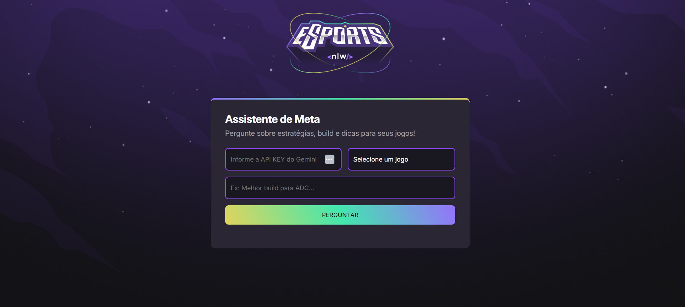

# 🧠 NLW Agents - Assistente de Meta


Projeto desenvolvido durante o **NLW da Rocketseat**, utilizando **HTML, CSS e JavaScript**, com foco em integração de IA para dicas e estratégias de jogos competitivos (como LoL, Valorant, CS:GO e outros).

## 🕹 Sobre o projeto

O **Assistente de Meta** é uma aplicação que usa a API do **Gemini AI** para responder dúvidas sobre **estratégias, builds e metas atualizadas** de jogos. O usuário informa sua chave de API, escolhe o jogo e faz sua pergunta — o assistente responde com base em conhecimento recente, incluindo patch atual e estilo de jogo.

### 📸 Preview




> Imagem do assistente com design moderno, tema escuro e foco em usabilidade.

## ⚙️ Funcionalidades

- ✅ Integração com API Gemini (Google)
- ✅ Reconhecimento do jogo selecionado
- ✅ Resposta com markdown convertida para HTML
- ✅ Validação de campos e feedback de carregamento
- ✅ Estilo neon moderno com animações suaves

## 🚀 Tecnologias utilizadas

- HTML5
- CSS3
- JavaScript (ES6)
- [Showdown.js](https://github.com/showdownjs/showdown) (para converter markdown)
- API Gemini (Google AI)

## 🛠 Como usar

1. Clone o repositório:

```bash
git clone https://github.com/seu-usuario/nlw-agents.git
cd nlw-agents
```

2. Abra o arquivo `index.html` em seu navegador ou use uma extensão como **Live Server** no VSCode.

3. Insira sua **API KEY do Gemini** no campo correspondente  
👉 Você pode gerar uma em: https://aistudio.google.com/app/apikey

4. Escolha o jogo e faça sua pergunta!

## 📂 Estrutura de Arquivos

```
nlw-agents/
├── index.html
├── style.css
├── script.js
├── assets/
│   ├── logo.png
│   └── bg.jpg
```

## 📌 Observações

- O projeto ainda pode ser expandido para suportar mais jogos.
- Respostas são limitadas a 500 caracteres para objetividade.
- O modelo Gemini é instruído a realizar pesquisas com base na data atual (se disponível).

## ✨ Créditos

Projeto inspirado e orientado pelas aulas do **NLW da Rocketseat**.  
Desenvolvido com 💜 por **Ricardo Leão**.